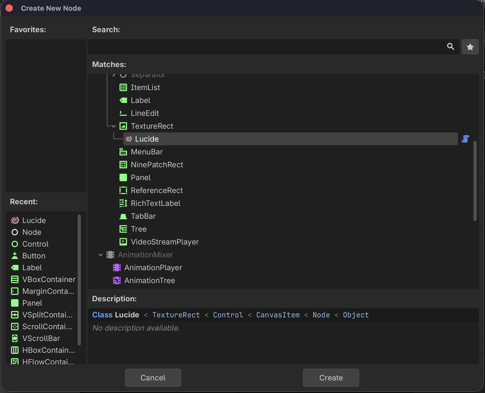
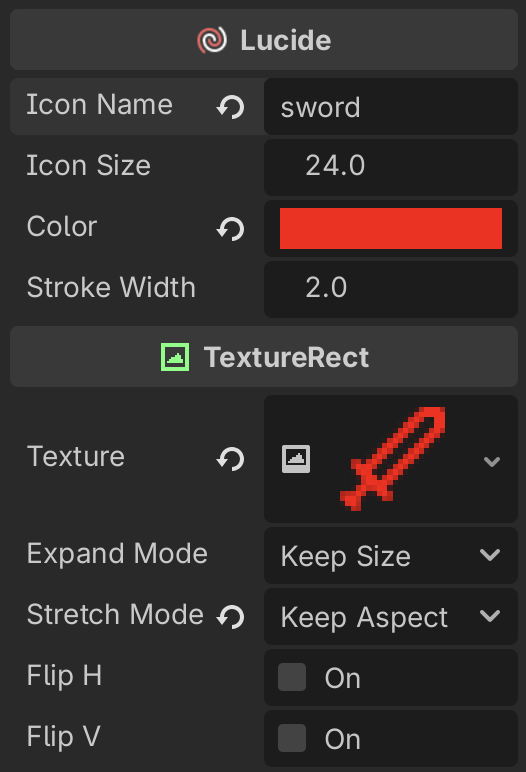
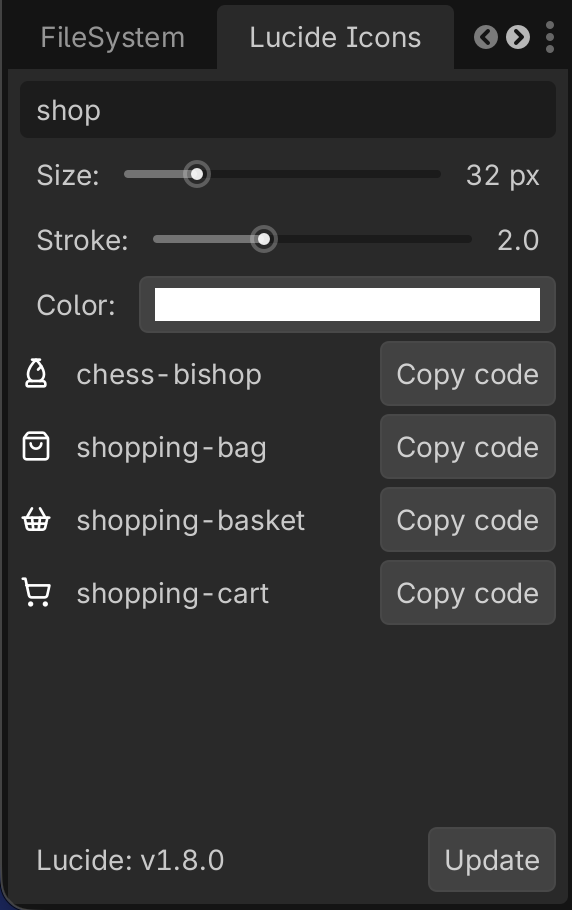

# Lucide Icons for Godot 4

A Godot 4 plugin that integrates [Lucide](https://lucide.dev) — a clean, consistent open-source icon library with 1 500+ SVG icons — directly into your projects.

Icons are downloaded from the official Lucide GitHub releases and rasterized on-the-fly at any size, with full control over color and stroke width. A built-in editor dock lets you browse, preview, and copy ready-to-use GDScript code for any icon.

---

## Features

- **1 500+ icons** sourced from the official Lucide releases
- **Custom `Lucide` node** — drop it in any scene like any other `TextureRect`
- **Fully configurable** — size, color, and stroke width per node, both in the Inspector and in code
- **Auto-download** — icons are fetched from GitHub on first use; no manual setup required
- **One-click update** — check and install the latest Lucide release from the editor dock
- **Editor dock** — search, preview, and copy GDScript snippets for any icon
- **Texture cache** — identical icon configurations are rasterized only once per session

---

## Requirements

- Godot 4.1 or later
- An internet connection for the initial icon download (or updates)

---

## Installation

### Via the Godot Asset Library

1. Open your project in Godot.
2. Go to **AssetLib** tab and search for **"Lucide Icons"**.
3. Click **Download**, then **Install**.
4. Enable the plugin under **Project → Project Settings → Plugins**.

### Manual

1. Download or clone this repository.
2. Copy the `addons/lucide/` folder into your project's `addons/` directory so the path becomes `res://addons/lucide/`.
3. Enable the plugin under **Project → Project Settings → Plugins → Lucide Icons**.

On first activation the plugin will automatically download the latest Lucide icon set from GitHub. Make sure your machine has internet access at that point.

---

## Usage

### In the Scene Tree (Inspector)

1. Add a **Lucide** node to your scene (`Add Node → Lucide`).

   

2. In the **Inspector** set the exported properties:

   

| Property | Type | Default | Description |
|---|---|---|---|
| `icon_name` | `String` | `""` | Name of the Lucide icon (e.g. `"house"`, `"circle-check"`) |
| `icon_size` | `float` | `24` | Rendered size in pixels (width and height) |
| `color` | `Color` | `WHITE` | Icon tint color |
| `stroke_width` | `float` | `2.0` | SVG stroke width |

### In Code (GDScript)

```gdscript
# Minimal — just the icon name
var icon := Lucide.new("house")
add_child(icon)

# Full constructor: name, size, color, stroke
var icon := Lucide.new("circle-check", 32, Color.GREEN, 1.5)
add_child(icon)
```

You can also change properties after the node is in the scene tree:

```gdscript
$MyIcon.icon_name   = "star"
$MyIcon.icon_size   = 48
$MyIcon.color       = Color.YELLOW
$MyIcon.stroke_width = 1.0
```

### Icon Names

Icon names match the Lucide identifier exactly, in kebab-case (e.g. `arrow-up-right`, `file-text`, `loader-circle`). The full list is available at [lucide.dev/icons](https://lucide.dev/icons).

---

## Editor Dock

When the plugin is enabled a **Lucide Icons** dock appears in the bottom-right panel.



| Control | Description |
|---|---|
| **Search** | Filter icons by name in real time |
| **Size** slider | Preview size (8 – 128 px) |
| **Stroke** slider | Preview stroke width (0.5 – 5.0) |
| **Color** picker | Preview tint color |
| **Copy code** button | Copies a ready-to-use `Lucide.new(...)` call to the clipboard |
| **Update** button | Checks GitHub for a newer Lucide release and downloads it |

The dock previews update live as you adjust size, stroke, and color.

---

## How It Works

### Icon Loading Pipeline

Each time an icon needs to be displayed the plugin:

1. Reads the SVG file from `res://addons/lucide/icons/<name>.svg`.
2. Injects the requested `color` and `stroke_width` values directly into the SVG markup.
3. Rasterizes the SVG to an `Image` at the requested scale.
4. Wraps it in an `ImageTexture` and assigns it to the `TextureRect`.

### Texture Cache

A **static dictionary** (`Lucide._cache`) stores every rendered texture keyed by `"path|size|color|stroke"`. Subsequent requests for the same combination return the cached texture instantly, avoiding redundant disk reads and rasterization.

### Lazy Initialization

Property setters skip `_reload()` until `_ready()` fires. This means constructing a node with `Lucide.new("icon", 32, color, 2.0)` triggers a single render pass instead of four.

### Auto-Download & Updates

On `_enter_tree`, the plugin checks whether `res://addons/lucide/icons/` exists. If not, it queries the GitHub Releases API for the latest Lucide version and downloads the SVG zip automatically. The installed version is tracked in `.lucide-version` (excluded from version control).

---

## Project Structure

```
addons/lucide/
├── plugin.cfg          # Godot plugin manifest
├── plugin.gd           # EditorPlugin — dock, download, update logic
├── lucide.gd           # Lucide node (TextureRect subclass)
├── icon.svg            # Plugin icon shown in the Godot editor
├── icons/              # Downloaded SVG icons (git-ignored)
└── .lucide-version     # Installed version tracker (git-ignored)
```

---

## License

This plugin is released under the [MIT License](LICENSE).

Lucide itself is also [MIT licensed](https://github.com/lucide-icons/lucide/blob/main/LICENSE). Icon attribution is not required but appreciated.
